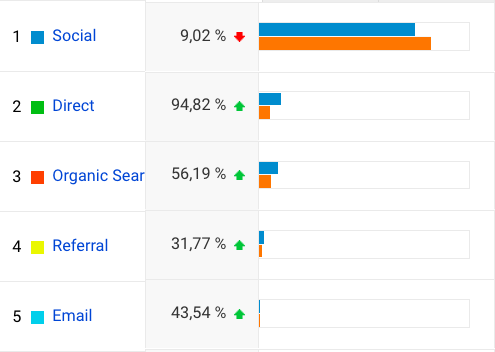

2017 var et rekordår for Folkets Avis på mange måder.

Således var også de samlede antal sidevisninger højere end noget tidligere år.

===

Ser vi på anskaffelse skete der noget lidt overraskende. I hvert fald når man tager i betratning at antallet af fans på [Folkets Avis Facebook side](https://www.facebook.com/folkets.dk/) voksede pænt hen over året og nærmede sig 10.000 ved dets afslutning.

For på trods af stigningen faldt antallet af brugere som blev sendt til [Folkets Avis](https://www.folkets.dk) fra de sociale medier, og med de sociale medier menes praktisk taget ene og alene Facebook.

Denne udvikling passer fint med Facebooks ambitioner om at holde flere brugere inden for Facebooks egne rammer. Samtidig gør medier klogt i at finde andre trafikkilder og opdyrke et eget trofast publikum.

Og måske endda tænke lidt i SEO-optimering.

Folkets Avis oplevede således en stor stigning - næsten en fordobling - af forside trafik i 2017 i forhold il 2016. Det er godt.

Flere kom også ind via søgninger på Google. Og web push notifikationer via Onesignal.

Et område hvor Folkets Avis virkelig kan oppe sig er på email. Altså at få brugere ind gennem nyhedsbreve.

Udviklingen på fem områder fra 2016 til 2017:

